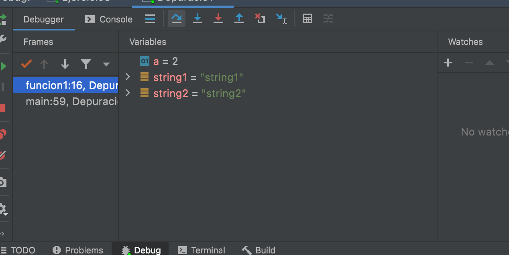
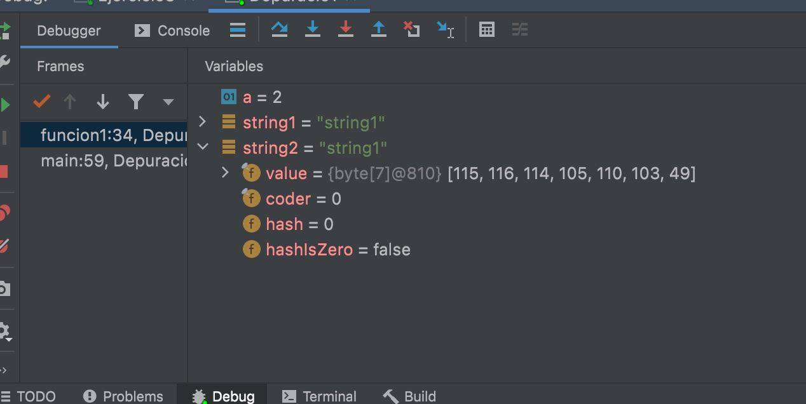
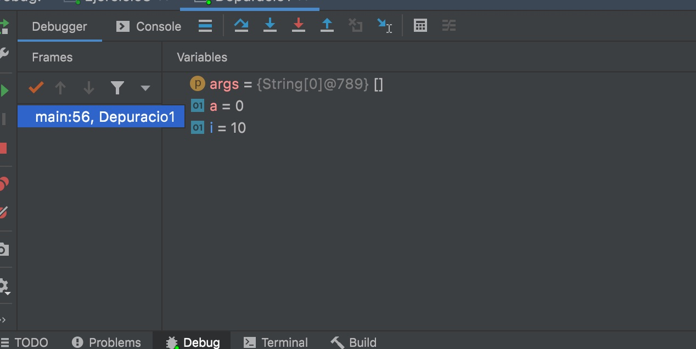
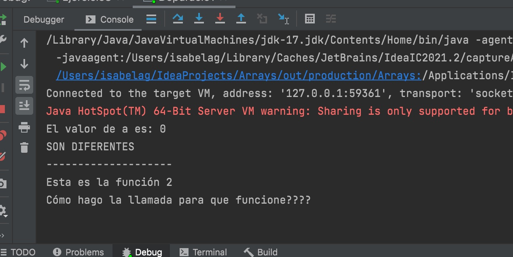

## Tasca Depuracion

### Ejercicio1

- String1="String1" y String="String2"
- 
  -La primera línea deja a String2="String" y la segunda línea le añade un uno a la cadena String2="String1". No lee la comparación y dice que son diferentes aún siendo iguales.

### Ejercicio 2

- El string1="string1" y string2="string2" tienes el mismo valor pero == no sirve para comparar dos cadenas de texto.
  

### Cómo hago que funcione función2()

- la declaro como public static void para que devuelva.

- la llamo dentro del main desde funcion2().
  
  
